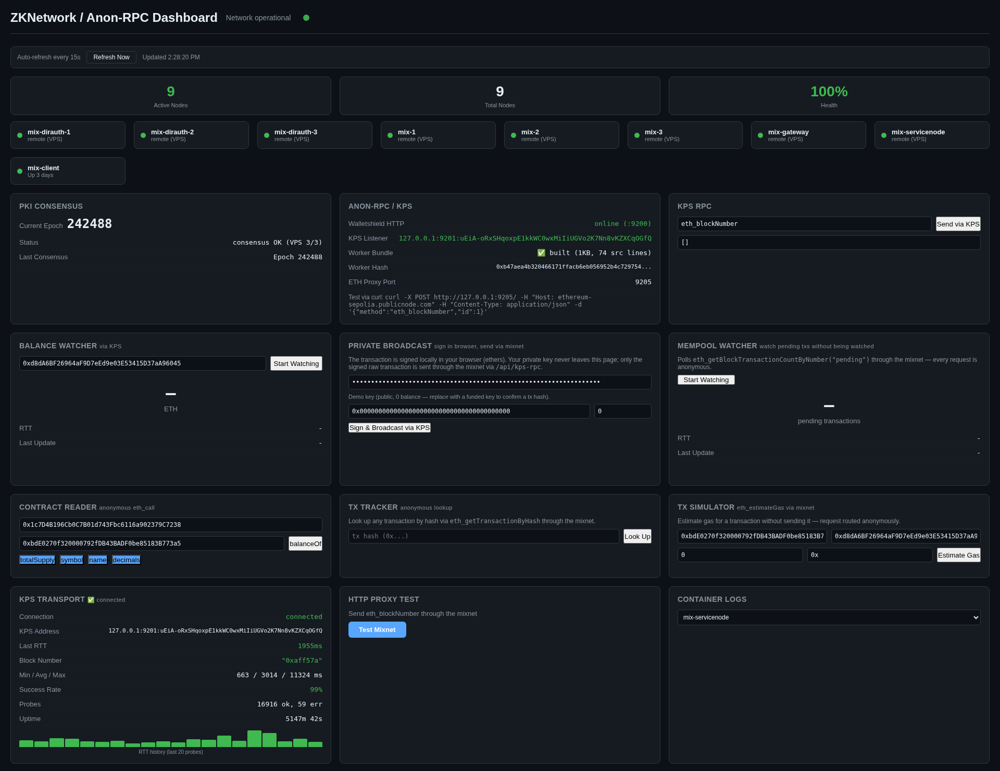

# ZKNet Anon-RPC Demo

Anonymously route Ethereum JSON-RPC through a live mixnet.



## Quick start

```bash
git clone https://github.com/Alchemi1/zknet-anon-rpc-demo.git
cd zknet-anon-rpc-demo

# Install Katzenpost submodule
git submodule update --init --recursive

# Copy environment template and edit if needed
cp .env.example .env

./start.sh
```

`start.sh` builds the Docker image (~15 min first time), starts the client,
waits for mixnet consensus (seconds), launches services and dashboard.
Later runs finish in ~30 seconds.

Then open the dashboard and run the full test suite:

```bash
open http://127.0.0.1:3517
./demo.sh    # 12 checks through the mixnet
```

## Configuration

All runtime config is in `.env` (copy from `.env.example`):

| Variable | Default | Description |
|---|---|---|
| `KATZENPOST_REF` | `v0.0.90` | Katzenpost git tag for submodule |
| `VPS_HOST` | `zknode-mix` | SSH alias for VPS sync |
| `VPS_GATEWAY_IP` | `185.92.181.101` | VPS gateway IP |
| `VPS_GATEWAY_PORT` | `30004` | VPS gateway port |
| `VPS_CLIENT_PATH` | `katzenpost/vps-config/client/client.toml` | Remote client config path |
| `RPC_URL` | `https://ethereum-sepolia.publicnode.com` | Ethereum RPC endpoint |
| `PRIVATE_KEY` | (empty) | Funded key for tx broadcast |
| `WS_HTTP_ADDR` | `127.0.0.1:9200` | WalletShield HTTP |
| `WS_KPS_ADDR` | `0.0.0.0:9201` | WalletShield KPS |
| `DASHBOARD_PORT` | `3517` | Dashboard port |

VPS config sync (run after VPS rebuild with fresh keys):
```bash
VPS_HOST=zknode-mix ./scripts/sync-vps-config.sh
```

## Architecture

Connects to the shared VPS mixnet at `tcp://$VPS_GATEWAY_IP:$VPS_GATEWAY_PORT`.
Local `mix-client` container runs:
- `kpclientd` — thin client daemon (Sphinx crypto, PKI)
- `http-proxy-client` — HTTP proxy on `:9205`
- `walletshield-kps` — WalletShield RPC on `:9200`, KPS on `:9201`
- `kps-monitor` — persistent KPS monitoring on `:9206`

All services talk to local `kpclientd` over thin-client protocol.

## License

Demo code: **BSD-3-Clause** (see `LICENSE`).
WalletShield: **AGPL-3.0-or-later** (see `walletshield/LICENSE`).
Katzenpost: **BSD-3-Clause** (submodule, see `katzenpost/LICENSE`).